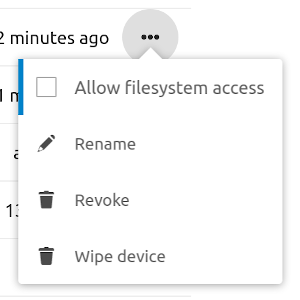

# nextcloud-exporter [](https://hub.docker.com/r/xperimental/nextcloud-exporter/)

A [prometheus](https://prometheus.io) exporter for getting some metrics of a nextcloud server instance.

## Installation

If you have a working Go installation, getting the binary should be as simple as

```bash
go get github.com/xperimental/nextcloud-exporter
```

## Client credentials

To access the serverinfo API you will need the credentials of an admin user. It is recommended to create a separate user for that purpose. It's also possible for the exporter to generate an "app password", so that the real user password is never saved to the configuration. This also makes the exporter show up in the security panel of the user as a connected application.

To let the nextcloud-exporter create an app password, start it with the `--login` parameter:

```bash
nextcloud-exporter --login --server https://nextcloud.example.com
```

The exporter will generate a login URL that you need to open in your browser. Be sure to login with the correct user if you created a special user for the exporter as the app password will be bound to the logged-in user. Once the access has been granted using the browser the exporter will output the username and password that need to be entered into the configuration.

When the login process is done, it is possible to disable filesystem access for the generated token in the user's settings:



---

The interactive login can also be done using a Docker container:

```bash
docker run --rm -it xperimental/nextcloud-exporter --login --server https://nextcloud.example.com
```

The login flow needs at least Nextcloud 16 to work.

## Usage

```plain
$ nextcloud-exporter --help
Usage of nextcloud-exporter:
  -a, --addr string          Address to listen on for connections. (default ":9205")
  -c, --config-file string   Path to YAML configuration file.
      --login                Use interactive login to create app password.
  -p, --password string      Password for connecting to Nextcloud.
  -s, --server string        URL to Nextcloud server.
  -t, --timeout duration     Timeout for getting server info document. (default 5s)
  -u, --username string      Username for connecting to Nextcloud.
```

After starting the server will offer the metrics on the `/metrics` endpoint, which can be used as a target for prometheus.

### Configuration methods

There are three methods of configuring the nextcloud-exporter (higher methods take precedence over lower ones):

- Environment variables
- Configuration file
- Command-line parameters

#### Environment variables

All settings can also be specified through environment variables:

|    Environment variable    | Flag equivalent |
| -------------------------: | :-------------- |
|         `NEXTCLOUD_SERVER` | --server        |
|       `NEXTCLOUD_USERNAME` | --username      |
|       `NEXTCLOUD_PASSWORD` | --password      |
| `NEXTCLOUD_LISTEN_ADDRESS` | --addr          |
|        `NEXTCLOUD_TIMEOUT` | --timeout       |

#### Configuration file

The `--config-file` option can be used to read the configuration options from a YAML file:

```yaml
# required
server: "https://example.com"
username: "example"
password: "example"
# optional
listenAddress: ":9205"
timeout: "5s"
```

### Password file

Optionally the password can be read from a separate file instead of directly from the input methods above. This can be achieved by setting the password to the path of the password file prefixed with an "@", for example:

```bash
nextcloud-exporter -c config-without-password.yml -p @/path/to/passwordfile
```

## Other information

### Info URL

The exporter reads the metrics from the Nextcloud server using its "serverinfo" API. You can find the URL of this API in the administrator settings in the "Monitoring" section. It should look something like this:

```plain
https://example.com/ocs/v2.php/apps/serverinfo/api/v1/info
```

The path will be automatically added to the server URL you provide, so in the above example setting `--server https://example.com` would be sufficient.

If you open this URL in a browser you should see an XML structure with the information that will be used by the exporter.

### Scrape configuration

The exporter will query the nextcloud server every time it is scraped by prometheus. If you want to reduce load on the nextcloud server you need to change the scrape interval accordingly:

```yml
scrape_configs:
  - job_name: 'nextcloud'
    scrape_interval: 90s
    static_configs:
      - targets: ['localhost:9205']
```

### Exported metrics

These metrics are exported by `nextcloud-exporter`:

| name                                   | description                                                            |
|----------------------------------------|------------------------------------------------------------------------|
| nextcloud_active_users_total           | Number of active users for the last five minutes                       |
| nextcloud_apps_installed_total         | Number of currently installed apps                                     |
| nextcloud_apps_updates_available_total | Number of apps that have available updates                             |
| nextcloud_auth_errors_total            | Counts number of authentication errors encountered by the collector    |
| nextcloud_database_size_bytes          | Size of database in bytes as reported from engine                      |
| nextcloud_exporter_info                | Contains meta information of the exporter. Value is always 1.           |
| nextcloud_files_total                  | Number of files served by the instance                                 |
| nextcloud_free_space_bytes             | Number of available disk space on the instance in bytes                |
| nextcloud_php_info                     | Contains meta information about PHP as labels. Value is always 1       |
| nextcloud_php_memory_limit_bytes       | Configured PHP memory limit in bytes                                   |
| nextcloud_php_upload_max_size_bytes    | Configured maximum upload size in bytes                                |
| nextcloud_scrape_errors_total          | Number of scrape errors from this collector                            |
| nextcloud_shares_federated_total       | Number of federated shares by directions `sent` / `received`           |
| nextcloud_shares_total                 | Number of shares by type: <br> `authlink`: shared password protected links <br> `group`: shared groups <br>`link`: all shared links <br> `user`: shared users |
| nextcloud_system_info                  | Contains meta information about Nextcloud as labels. Value is always 1 |
| nextcloud_up                           | Shows if nextcloud instance is up `0` down / `1` up                    |
| nextcloud_users_total                  | Number of users of the instance                                        |
